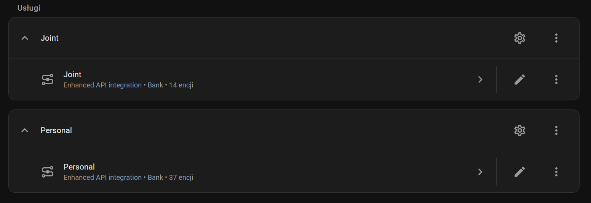
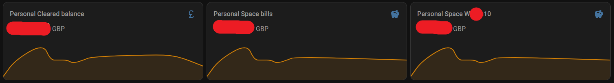
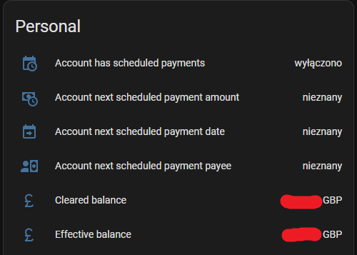
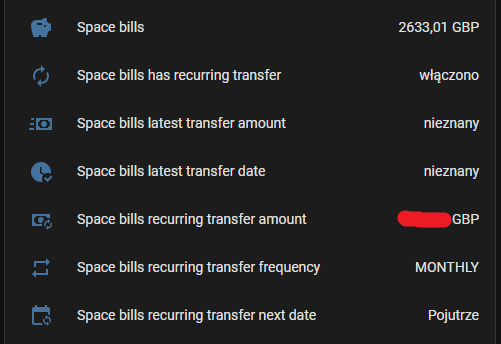
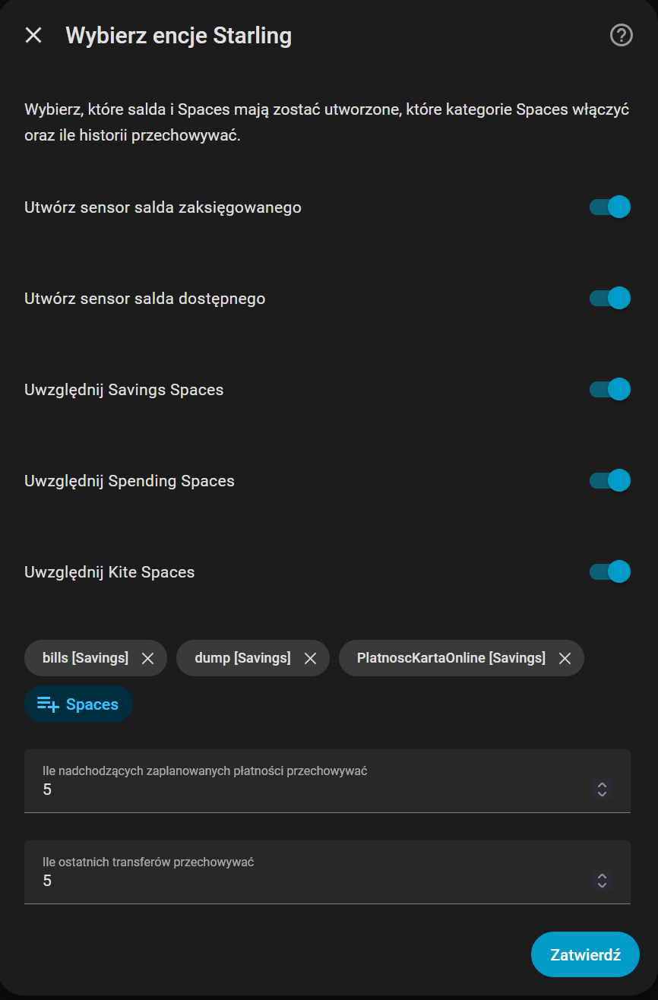
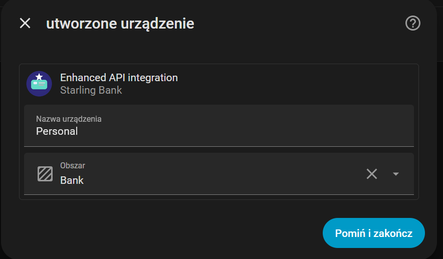

[](https://hacs.xyz/)
[](https://github.com/ILoveMyProjects/SarlingBankEnhanced/actions/workflows/validate.yml)
[](https://github.com/ILoveMyProjects/SarlingBankEnhanced/actions/workflows/hassfest.yml)
[](https://github.com/ILoveMyProjects/SarlingBankEnhanced/releases)
[](https://www.home-assistant.io/)
[]

# Starling Bank Enhanced for Home Assistant

A custom Home Assistant integration for Starling Bank with UI-based setup, richer read-only account entities, Spaces support, scheduled payment visibility, recurring savings-goal transfer visibility, and integration diagnostics helpers.

## Disclaimer

This project is **not affiliated with Starling Bank**.
Starling Bank is a registered trademark of Starling Bank Ltd.

## What is included

Work with account types:
- Personal
- Joint

This integration adds:

- UI configuration from **Settings → Devices & Services**
- **Cleared balance** and **effective balance** sensors
- **Spaces / savings goals** sensors
- **Scheduled payments** sensors and binary sensor
- **Recurring savings-goal transfer** sensors and binary sensor
- **Savings-goal transfer history** sensors with recent-transfer attributes
- **Diagnostics sensors** for refresh status, request count, and API backoff / rate-limit state
- **Options flow** to enable or disable entities later
- **Reconfigure** flow to replace the token without deleting the integration
- Separate domain: `starlingbank_enhanced`
- Ability to run **alongside** the built-in `starlingbank` integration

## Screenshots

### Cards


### Cards


### Entities

#### Main account


#### Space (bils)


### Config

#### Entity


#### Space


## Why this exists

The built-in Home Assistant Starling Bank integration is documented as a **legacy integration** and uses YAML configuration. This custom integration keeps the same read-only approach, but adds a modern Home Assistant UX, feature-based setup, Spaces support, scheduled payment visibility, recurring transfer visibility, and richer diagnostics.

## Features

### 1. Main account balances

Optional entities:

- **Cleared balance**
- **Effective balance**

You can enable one or both during setup.

### 2. Spaces / savings goals

Optional entities:

- One sensor per selected **Space / savings goal**

Behavior:

- Spaces are discovered during setup
- You can choose only the Spaces you want exposed in Home Assistant
- The list can be refreshed later from **Configure / Options**

### 3. Scheduled payments

Optional entities:

- `sensor.<account>_scheduled_payments_count`
- `sensor.<account>_next_scheduled_payment_date`
- `sensor.<account>_next_scheduled_payment_amount`
- `sensor.<account>_next_scheduled_payment_payee`
- `binary_sensor.<account>_has_scheduled_payments`

Behavior:

- Keeps the next scheduled payments in state attributes
- `upcoming_limit` controls how many upcoming payments are stored in attributes
- Useful for dashboards, alerts, and automations

### 4. Recurring savings-goal transfers

For each selected Space, optional entities:

- recurring transfer amount
- recurring transfer next date
- recurring transfer frequency
- latest transfer amount
- latest transfer date
- transfer history count
- binary sensor showing whether a recurring transfer exists

Behavior:

- `history_limit` controls how many recent transfers are stored in attributes
- Transfer history is based on settled feed items for the account category
- Intended for visibility and automation only, not for money movement

### 5. Diagnostics

Always-created diagnostics entities:

- **Last successful refresh**
- **Last rate limit at**
- **Backoff until**
- **Request count last cycle**

These help with debugging, API throttling visibility, and checking when data was last refreshed.

## Home Assistant UX

- Add from **Settings → Devices & Services → Add Integration**
- No YAML required
- Token can be changed later from **Reconfigure**
- Entity selection is feature-aware
- Options flow lets you change enabled balances, Spaces, and retention limits later

## Configuration flow

This integration is configured fully from the Home Assistant UI.

### Step 1: choose features

You can enable any combination of:

- **Main balance**
- **Spaces**
- **Scheduled payments**
- **Savings goal transfers**

Notes:

- Selecting **Savings goal transfers** automatically requires **Spaces** support as well
- The setup flow validates the token against the selected features
- If permissions are missing, the form shows which scopes are required

### Step 2: provide token

You provide:

- a **Starling personal access token**
- whether to use **sandbox mode**

### Step 3: choose entities

Depending on enabled features, you can choose:

- cleared balance sensor
- effective balance sensor
- selected Spaces
- upcoming scheduled payment retention limit
- recent transfer history retention limit

## Getting a Starling personal access token

To use this integration with your real Starling account, you need a **personal access token** from the official Starling Developer Portal.

Official documentation:
- [Starling Developers documentation](https://developer.starlingbank.com/docs)

### Production token for your real account

1. Open the Starling Developer Portal:
   [https://developer.starlingbank.com/docs](https://developer.starlingbank.com/docs)
2. Sign in with your Starling account.
3. Link your Starling account in the Developer Portal if prompted (personal or joint).
4. Create a **personal access token**.
5. Select the scopes required for the features you want to enable in Home Assistant.
6. Copy the token and keep it safe.
7. In Home Assistant, paste the token during the integration setup flow.

### Sandbox token for testing

If you want to test the integration with dummy data instead of your real bank account, use the Starling sandbox and enable **sandbox mode** during setup.

## Token permissions

Minimum scopes depend on the enabled features.

### Main balance

- `account:read`
- `balance:read`

### Spaces

- `account:read`
- `savings-goal:read`
- `space:read`

### Scheduled payments

- `account:read`
- `scheduled-payment:read`
- `transaction:read`

### Savings-goal transfers

- `account:read`
- `savings-goal-transfer:read`
- `savings-goal:read`
- `space:read`
- `transaction:read`

> The integration is read-only. It does not move money or create payments.

## Token renewal and reauthentication

If your Starling token expires or is revoked, the integration may require reauthentication.

To restore access:
1. Create a new personal access token in the Starling Developer Portal.
2. Open the integration in Home Assistant.
3. Use **Reconfigure** and paste the new token.

Make sure the replacement token includes the same scopes required by your enabled features.

## Installation

### HACS

1. Open HACS.
2. Go to the top-right menu and select **Custom repositories**.
3. Add the repository URL.
4. Select **Integration** as the category.
5. Install **Starling Bank Enhanced**.
6. Restart Home Assistant.
7. Go to **Settings → Devices & Services → Add Integration**.
8. Search for **Starling Bank Enhanced**.

### Manual

1. Copy `custom_components/starlingbank_enhanced` into:

```text
/config/custom_components/starlingbank_enhanced
```

2. Restart Home Assistant.
3. Go to **Settings → Devices & Services → Add Integration**.
4. Search for **Starling Bank Enhanced**.

## Example entities

Main account:

- `sensor.personal_cleared_balance`
- `sensor.personal_effective_balance`

Spaces:

- `sensor.personal_space_holiday`
- `sensor.personal_space_emergency_fund`

Scheduled payments:

- `sensor.personal_scheduled_payments_count`
- `sensor.personal_next_scheduled_payment_date`
- `sensor.personal_next_scheduled_payment_amount`
- `sensor.personal_next_scheduled_payment_payee`
- `binary_sensor.personal_has_scheduled_payments`

Recurring transfers / transfer history:

- `sensor.personal_holiday_recurring_transfer_amount`
- `sensor.personal_holiday_recurring_transfer_next_date`
- `sensor.personal_holiday_recurring_transfer_frequency`
- `sensor.personal_holiday_transfer_history_count`
- `sensor.personal_holiday_latest_transfer_amount`
- `sensor.personal_holiday_latest_transfer_date`
- `binary_sensor.personal_holiday_has_recurring_transfer`

Diagnostics:

- `sensor.personal_last_successful_refresh`
- `sensor.personal_last_rate_limit_at`
- `sensor.personal_backoff_until`
- `sensor.personal_request_count_last_cycle`

Entity IDs depend on Home Assistant naming rules.

## Refresh behavior

The coordinator uses staggered refresh behavior instead of hitting every endpoint on every cycle.

Current defaults in code:

- general scan interval: **10 minutes**
- account refresh: **6 hours**
- savings / Spaces refresh: **30 minutes**
- scheduled payments refresh: **30 minutes**
- transfer history refresh: **30 minutes**
- rate-limit backoff default: **300 seconds**
- transfer history lookback: **90 days**

This reduces API load and makes rate-limit handling more predictable.

## Notes and limitations

- Domain: `starlingbank_enhanced`
- IoT class: `cloud_polling`
- Read-only integration
- No transaction import UI
- No money movement, transfers, or write actions
- Scheduled payments and transfer history are for visibility only
- Savings-goal transfer history depends on Starling API data returned for settled feed items
- Some Spaces or transfer-related features may not be available for all account types.
- Data refresh is staggered to reduce API load and rate-limit pressure.

## Tested with

- Home Assistant Core 2026.3.1
- Home Assistant OS 17.1
- Supervisor 2026.03.0

## Repository structure

```text
.
├── .github/
│   └── workflows/
│       ├── hassfest.yml
│       └── validate.yml
├── .gitignore
├── LICENSE
├── README.md
├── hacs.json
├── custom_components/
│   └── starlingbank_enhanced/
│       ├── __init__.py
│       ├── api.py
│       ├── binary_sensor.py
│       ├── config_flow.py
│       ├── const.py
│       ├── coordinator.py
│       ├── diagnostics.py
│       ├── manifest.json
│       ├── sensor.py
|       ├── brand/
│       │   ├── icon.png
│       │   ├── icon.svg
│       │   └── logo.png
│       └──  translations/
│           ├── en.json
│           └── pl.json
|
└── tests/
    └── components/
        └── starlingbank_enhanced/
            ├── __init__.py
            ├── conftest.py
            ├── test_config_flow.py
            └── test_init.py
```
## Troubleshooting

### The integration does not appear in Add Integration
- Restart Home Assistant after installation.
- If installed through HACS, make sure the repository type was set to **Integration**.

### Token validation fails
- Make sure you created a **personal access token** in the Starling Developer Portal.
- Make sure the token includes all scopes required by the enabled features.
- If you are testing with dummy data, enable **sandbox mode**.

### The integration stops updating
- Your token may have expired or been revoked.
- Create a new token and use **Reconfigure** in Home Assistant.

### Spaces are missing
- Check that Spaces-related scopes are granted.
- Check whether Space category filters disabled the missing Spaces.

### Scheduled payments or recurring transfer entities are empty
- Check whether the required feature was enabled during setup.
- Check whether the token includes the required scopes.
- Some data may not exist for the selected account.

## License

This repository uses the **MIT License**.
